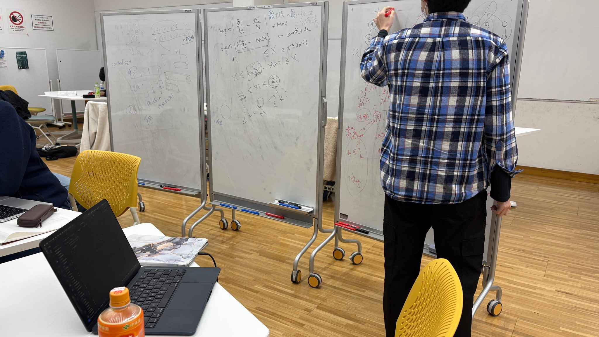
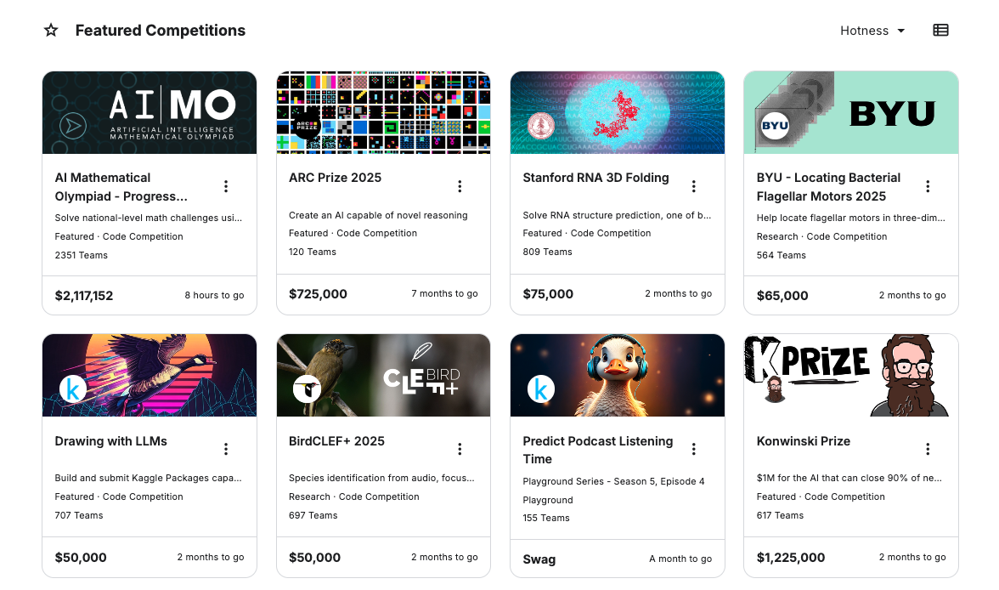

# 2026年度新歓活動について
**[新歓・見学についての記事]({{ '/posts/welcome-activities/' | url }})** をご参照ください。

# WACPAC について

**早稲田競技系プログラミングサークル WACPAC** は、2024年秋学期から活動している、競技系プログラミングを扱うサークルです。**いまの主な活動は競技プログラミング**で、バーチャルコンテストや解説会、[ICPC](https://icpc.iisf.or.jp/) への参加などを行っています。Kaggle や CTF に関する活動も、今後広げていきたいと考えています。

プログラミングが好きな方、パズルや数学が好きな方、**初心者から経験者まで**、幅広いレベルで楽しめることを目指しています。

**[→ 活動内容の詳しい説明はこちら]({{ '/posts/overview/' | url }})**

---

## 連絡・見学・入会について

**早稲田大学に所属する方であれば、学部・大学院を問わずご入会いただけます。** 特定の新歓期間に限らず、見学や入会の相談も受け付けています。

お問い合わせ・見学・入会の希望・質問等は **[公式 X（@wacpac_wsd）の DM](https://x.com/wacpac_wsd)** からお願いします！

---

## 活動の様子

バーチャルコンテスト後の解説会の様子（一例）です。

Kaggle のコンペ一覧（参考・当時のスクリーンショット）。

